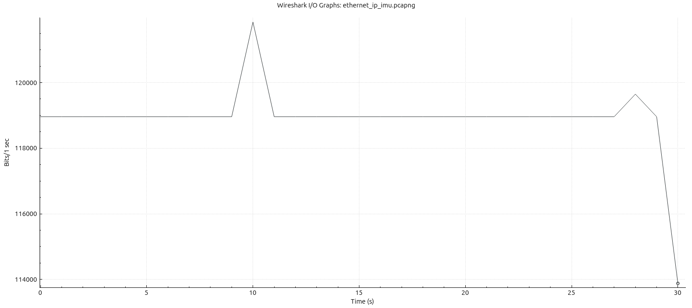

# Bandwidth Comparison

This test recorded one-sided communication of the IMU message for each protocol. The idea was to determine the amount of data required to essentially transmit the same data. Not identical payloads, but what that data represents: a basic IMU message.

The test recorded 30s of data using Wireshark, started and stopped while data is transmitting in steady-state

## Bits/s

## micro-ROS

## proton

Based on exported data, micro-ROS uses an average of 363166 bits/s, vs proton's 143305 bits/s. proton uses approx 39.4% of the same raw bandwidth to send the same data.

This is largely chalked up to the fact that proton only sends as much data as it needs to. micro-ROS uses the ROS standard serialization (effectively none) and ends up transmitting the entire sensor_msgs/msg/Imu message, which is 340 bytes long. That includes three 9-element covariances, and the unused 4-element orientation message.

proton inherits protobuf's varint encoding, meaning that data is compressed slightly, and only sends the gyro, accel, and a single value for their covariances, which can be used as a coefficient for the covariance matrix in the ROS bridging layer.

## EtherNet/IP

EtherNet/IP is an industrial communications protocol based on the ODVA CIP protocol, commonly used in Rockwell Automation devices. In this case, the data has been captured from a real IMU from a Rockwell Automation device. The communication path used in this example is "Connected" using an Assembly object composed of IMU data and timestamps set to the same data types used in the other examples (`double`'s for scalars, `int64_t`'s for timestamps). EtherNet/IP ends up using less data on the wire than proton, largely because protobuf encodes tag-length-value data into compressed double types, whereas EtherNet/IP does not use any serialization at all. If all participants know that the data will appear this way, then decoding is fast an efficient. But this can be brittle in actual implementation if the communication schema ever ends up changing.

An additional note: EtherNet/IP requires additional sockets to initiate connected messaging. One TCP socket to register a device on the EtherNet/IP network, and an additional TCP transaction to initiate connected messaging matching various descriptors. This is a pretty common EIP usecase, especially for high-speed sensors and actuators.
